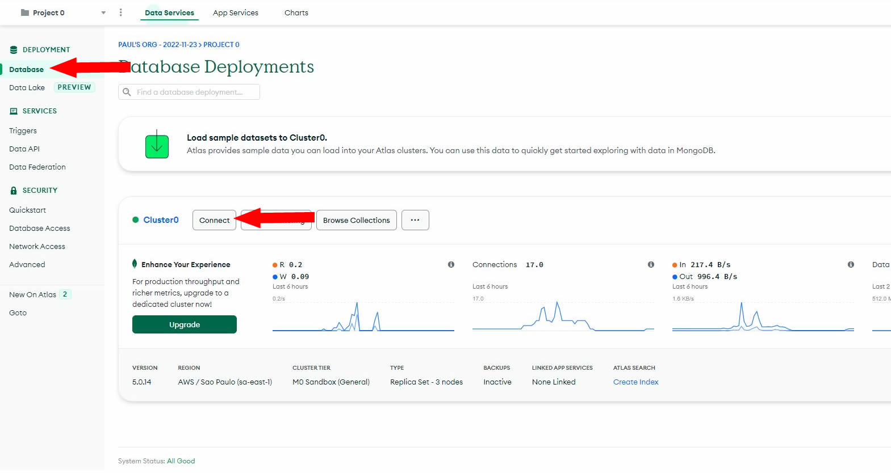

## Social Media App Base

Fullstack Responsive MERN App with Auth, Likes, Dark Mode | React, MongoDB, MUI

This project was created watching this [Video](https://www.youtube.com/watch?v=K8YELRmUb5o).

You can see each Chapter of the video as an Step Commit.

# Server

- Go to [https://www.mongodb.com/](https://www.mongodb.com/)
- Create an Atlas account, verify your email
- In "Deploy a cloud database" select Free (unless you want to pay)
- In "Cloud Provider & Region" select the region closest to you
- In "Security Quickstart" step 1, select "Username and Password", complete the steps.
- Go to Database -> Connect
  
- Go to "Connect your application"
  
- Copy the following line
  
- Go to `/server` copy `.env.example` and rename to `.env`
- Paste the copied line to `MONGO_URL` make sure to replace the user and the password with the ones used in the "Security Quickstart"
- Set the `JWT_SECRET` to anything you want
- Remember to put the `MONGO_URL` and `JWT_SECRET` in single quotes
- Run `npm i` inside `/server`
- Run `npx nodemon index.js`

# Client

- Inside `/client` run `npm i` then `npm run start`.
